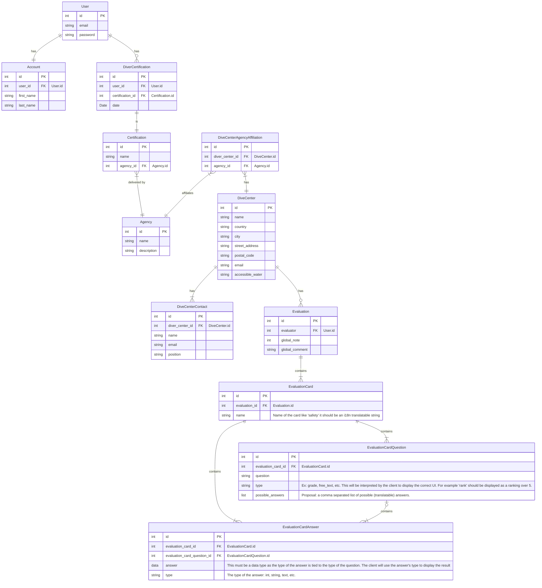

# argoteam-dice-api
Argoteam's repository for DIve CEnter evaluations and database REST API.

# PURPOSE

The purpose of this API is to provide an agnostic backend for dive center evaluations.
It functions has a front for the database and provides a flexible and configurable interface to create evaluation cards.
Evaluation cards are very configurable to provide flexibility and evolution capabilities over time.

# MODEL

The database model is as follow:



In short, the user info are decoupled from the account info and from the right management system. The diver profile information are actually held by the diver's certifications. A diver can have multiple certifications from multiple agencies.

Dive centers can have multiple contacts and can be affiliated to multiple agencies. They can also have multiple point of contact. A contact can only be related to one dive center though. A dive center can have multiple evaluations (obviously).

An evaluation only contains global information: a note and a comment. All the specific evaluation data are in the EvaluationCard. The card is dynamically build with a set of EvaluationCardQuestions to which an EvaluationCardAnswer is provided. An evaluation card can contains multiple questions but a question is linked to only one card. An answer belongs to a single question and a single card (answers are specific to a question in a card). Both the question and the answer contains the type that is expected.

There are 2 main questions left on the data model:

 1. Should the answer be serialized as JSON strings or binary data (my personal preference is to strings since binary makes little sense in this context).
 2. Should the possible answers be included in the data model (considering that at this point we do not have multiple answers in the form), and if for future proofing reasons we do include them, shouldn't they be in a EvaluationCardQuestionPossibleAnswer table? The argument for making it a coma separated list for now is that we do not have questions with multiple answers, so it is possible that it will never be useful.

The API does not mandate a specific presentation, it only provides the data for the client (web app, mobile app, etc.) to present them to the end user.

# BUILD / DEVELOP

There's a Makefile at the root of the directory, it contains all the basic commands you will need to contribute/use that API.

The API is written in Python and Flask. Please have a look at the requirements.txt for the list of required dependencies.

## Build the Docker image for the API

```make docker-build```

## Run the Docker image for the API

```make docker-run```

## initialize the database

We use SQLAlchemy for the database.

```make initdb```

## Migrate the database

```make migratedb```

## Upgrade the database

```make upgradedb```
